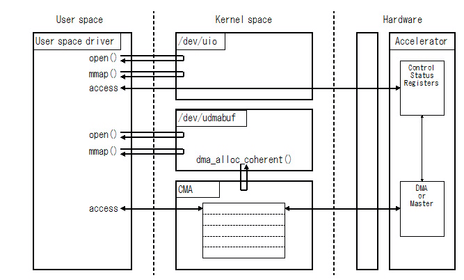

u-dma-buf(User space mappable DMA Buffer)
==================================================================================


# はじめに


## u-dma-bufとは


u-dma-buf はLinux のカーネル空間に連続したメモリ領域をDMAバッファとして確保し、ユーザー空間からアクセス可能にするためのデバイスドライバです。主にUIO(User space I/O)を使ってユーザー空間でデバイスドライバを動かす場合のDMAバッファを提供します。

ユーザー空間でu-dma-bufで確保したDMAバッファを利用する際は、デバイスファイル(/dev/udmabuf0など)をopen()して、mmap()でユーザー空間にマッピングするか、read()またはwrite()で行います。

openする際にO_SYNCフラグをセットすることによりCPUキャッシュを無効にすることが出来ます。また、CPUキャッシュを有効にした状態で、CPUキャッシュのフラッシュとインヴァリディエートを行うことが出来ます(ARMアーキテクチャのみ)。

/sys/class/u-dma-buf/udmabuf0/phys_addr を読むことにより、DMAバッファの物理空間上のアドレスを知ることが出来ます。

u-dma-bufのDMAバッファの大きさやデバイスのマイナー番号は、デバイスドライバのロード時(insmodによるロードなど)に指定できます。またプラットフォームによってはデバイスツリーに記述しておくこともできます。


## 構成




図1 構成

<br />


## 対応プラットフォーム


* OS : Linux Kernel Version 3.6 - 3.8, 3.18, 4.4, 4.8, 4.12, 4.14, 4.19, 5.0 - 5.2
(私が動作を確認したのは3.18, 4.4, 4.8, 4.12, 4.14, 4.19 です).
* CPU: ARM Cortex-A9 (Xilinx ZYNQ / Altera CycloneV SoC)
* CPU: ARM64 Cortex-A53 (Xilinx ZYNQ UltraScale+ MPSoC)
* CPU: x86(64bit) ただし検証が不十分です。皆さんからの結果を期待しています。また、現時点では以下の機能に制限があります。

  * O_SYNCフラグによるCPUキャッシュの制御が出来ません。常にCPUキャッシュは有効です。
  * sync_for_cpu、sync_for_deviceによる手動でのCPUキャッシュの制御が出来ません。
  * デバイスツリーによる各種設定が出来ません。


## 注意: udmabuf から u-dma-buf へ

### u-dma-bufの前身

u-dma-buf の前身は udmabuf です。"udmabuf" から "u-dma-buf" にカーネルモジュール名を変更しました。これは Linux Kernel 5.x から "udmabuf" と同じ名前の別のカーネルモジュールが追加されたため、名前の重複をさけるのが目的です。

### udmabuf から u-dma-buf への変更点

| Categoly            | udmabuf                | u-dma-buf               |
|:--------------------|:-----------------------|:------------------------|
| module name         | udmabuf.ko             | u-dma-buf.ko            |
| source file         | udmabuf.c              | u-dma-buf.c             |
| sys class name      | /sys/class/udmabuf/    | /sys/class/u-dma-buf/   |
| DT compatible prop. | "ikwzm,udmabuf-0.10.a" | "ikwzm,u-dma-buf"       |


# 使い方


## コンパイル


次のようなMakefileを用意しています。


```Makefile:Makefile
HOST_ARCH       ?= $(shell uname -m | sed -e s/arm.*/arm/ -e s/aarch64.*/arm64/)
ARCH            ?= $(shell uname -m | sed -e s/arm.*/arm/ -e s/aarch64.*/arm64/)
KERNEL_SRC_DIR  ?= /lib/modules/$(shell uname -r)/build

ifeq ($(ARCH), arm)
 ifneq ($(HOST_ARCH), arm)
   CROSS_COMPILE  ?= arm-linux-gnueabihf-
 endif
endif
ifeq ($(ARCH), arm64)
 ifneq ($(HOST_ARCH), arm64)
   CROSS_COMPILE  ?= aarch64-linux-gnu-
 endif
endif

u-dma-buf-obj           := u-dma-buf.o
obj-$(CONFIG_U_DMA_BUF) += $(u-dma-buf-obj)

all:
	make -C $(KERNEL_SRC_DIR) ARCH=$(ARCH) CROSS_COMPILE=$(CROSS_COMPILE) M=$(PWD) obj-m=$(u-dma-buf-obj) u-dma-buf.ko

clean:
	make -C $(KERNEL_SRC_DIR) ARCH=$(ARCH) CROSS_COMPILE=$(CROSS_COMPILE) M=$(PWD) clean

```


## インストール


insmod でu-dma-bufのカーネルドライバをロードします。この際に引数を渡すことによりDMAバッファを確保してデバイスドライバを作成します。insmod の引数で作成できるDMAバッファは udmabuf0/1/2/3/4/5/6/7の最大８つです。


```console
zynq$ insmod u-dma-buf.ko udmabuf0=1048576
u-dma-buf udmabuf0: driver installed
u-dma-buf udmabuf0: major number   = 248
u-dma-buf udmabuf0: minor number   = 0
u-dma-buf udmabuf0: phys address   = 0x1e900000
u-dma-buf udmabuf0: buffer size    = 1048576
u-dma-buf udmabuf0: dma coherent = 0
zynq$ ls -la /dev/udmabuf0
crw------- 1 root root 248, 0 Dec  1 09:34 /dev/udmabuf0
```


パーミッションがrootのみ読み書き可能になっています。ロード時にパーミッションを変更したい場合は、/etc/udev/rules.d/99-u-dma-buf.rules というファイルを作成し、以下の内容を書いておきます。


```rules:99-u-dma-buf.rules
KERNEL=="udmabuf[0-9]*", GROUP="root", MODE="0666"
```


アンインストールするには rmmod を使います。


```console
zynq$ rmmod u-dma-buf
u-dma-buf udmabuf0: driver uninstalled
```


## Debian パッケージによるインストール


以下のURL に u-dma-buf を Debian パッケージ化するリポジトリを用意しています。詳細は以下の URL を参照してください。

*  https://github.com/ikwzm/u-dma-buf-kmod-dpkg


## デバイスツリーによる設定


u-dma-bufはinsmod の引数でDMAバッファを用意する以外に、Linuxのカーネルが起動時に読み込むdevicetreeファイルによってDMAバッファを用意する方法があります。devicetreeファイルに次のようなエントリを追加しておけば、insmod でロードする際に自動的にDMAバッファを確保してデバイスドライバを作成します。


```devicetree:devicetree.dts
		udmabuf@0x00 {
			compatible = "ikwzm,u-dma-buf";
			device-name = "udmabuf0";
			minor-number = <0>;
			size = <0x00100000>;
		};

```


```console
zynq$ insmod u-dma-buf.ko
u-dma-buf udmabuf0: driver installed
u-dma-buf udmabuf0: major number   = 248
u-dma-buf udmabuf0: minor number   = 0
u-dma-buf udmabuf0: phys address   = 0x1e900000
u-dma-buf udmabuf0: buffer size    = 1048576
u-dma-buf udmabuf0: dma coherent  = 0
zynq$ ls -la /dev/udmabuf0
crw------- 1 root root 248, 0 Dec  1 09:34 /dev/udmabuf0
```


デバイスツリーでは以下のプロパティを設定することができます。

  *  compatible
  *  size
  *  minor-number
  *  device-name
  *  sync-mode
  *  sync-always
  *  sync-offset
  *  sync-size
  *  sync-direction
  *  dma-coherent
  *  memory-region


### compatible


compatible プロパティはデバイスツリーをロードした際に対応するデバイスドライバを指定します。compatible プロパティは必須です。compatible プロパティには必ず "ikwzm,u-dma-buf" を指定してください。


### size


size プロパティはDMAバッファの容量をバイト数で指定します。size プロパティは必須です。


```devicetree:devicetree.dts
		udmabuf@0x00 {
			compatible = "ikwzm,u-dma-buf";
			size = <0x00100000>;
		};

```


### minor-number


minor-number プロパティはu-dma-bufのマイナー番号を指定します。マイナー番号は0から255までつけることができます。ただし、insmodの引数の方が優先され、マイナー番号がかち合うとdevicetreeで指定した方が失敗します。

minor-number プロパティは省略可能です。minor-number プロパティが省略された場合、空いているマイナー番号が割り当てられます。


```devicetree:devicetree.dts
		udmabuf@0x00 {
			compatible = "ikwzm,u-dma-buf";
			minor-number = <0>;
			size = <0x00100000>;
		};

```


### device-name


device-name プロパティはデバイス名を指定します。

device-name プロパティは省略可能です。デバイス名は次のように決まります。

1. device-name プロパティが指定されていた場合は、 device-name。
2. device-name プロパティが省略されていて、かつminor-number プロパティが指定されていた場合は、sprintf("udmabuf%d", minor-number)。
3. device-name プロパティが省略されていて、かつminor-number プロパティも省略されていた場合は、devicetree のエントリー名(例ではudmabuf@0x00)。


```devicetree:devicetree.dts
		udmabuf@0x00 {
			compatible = "ikwzm,u-dma-buf";
			device-name = "udmabuf0";
			size = <0x00100000>;
		};

```


### sync-mode


sync-mode プロパティはu-dma-bufをopenする際にO_SYNCを指定した場合の動作を指定します。

* sync-mode=<1>:  open 時にO_SYNCフラグが設定された場合または sync-always プロパティが設定されていた場合、CPUキャッシュを無効にします。O_SYNCフラグが設定されなかった場合、CPUキャッシュは有効です。
* sync-mode=<2>: open 時に O_SYNCフラグが設定された場合または sync-always プロパティが設定されていた場合、CPUがDMAバッファに書き込む際、ライトコンバインします。ライトコンバインとは、基本的にはCPUキャッシュは無効ですが、複数の書き込みをまとめて行うことで若干性能が向上します。O_SYNCフラグが設定されなかった場合、CPUキャッシュは有効です。
* sync-mode=<3>: open 時にO_SYNCフラグが設定された場合または sync-always プロパティが設定されていた場合、DMAコヒーレンシモードにします。O_SYNCフラグが設定されなかった場合、CPUキャッシュは有効です。

sync-mode プロパティは省略可能です。sync-mode プロパティが省略された場合は <1> に設定されます。


```devicetree:devicetree.dts
		udmabuf@0x00 {
			compatible = "ikwzm,u-dma-buf";
			size = <0x00100000>;
			sync-mode = <2>;
		};

```


O_SYNCおよびキャッシュの設定に関しては次の節で説明します。


### sync-always


sync-always プロパティを設定した時、 u-dma-buf を open する際に O_SYNC の指定に関わらず常に sync-mode プロパティで指定された動作することを指定します。


```devicetree:devicetree.dts
		udmabuf@0x00 {
			compatible = "ikwzm,u-dma-buf";
			size = <0x00100000>;
			sync-mode = <2>;
			sync-always;
		};

```


O_SYNCおよびキャッシュの設定に関しては次の節で説明します。


### sync-offset


sync-offset プロパティは u-dma-buf のキャッシュ制御を手動で行う際のバッファの範囲の先頭を指定します。

sync-offset プロパティは省略可能です。sync-offset プロパティが省略された場合は<0> になります。

手動でキャッシュを制御する方法は次の節で説明します。


### sync-size


sync-size プロパティは  u-dma-buf  のキャッシュ制御を手動で行う際のバッファの範囲のサイズを指定します。

sync-size プロパティは省略可能です。sync-size プロパティが省略された場合は、size プロパティと同じ値になります。

手動でキャッシュを制御する方法は次の節で説明します。


### sync-direction


sync-direction プロパティは u-dma-buf のキャッシュ制御を手動で行う際のDMAの方向を指定します。

* sync-direction=<0>: DMA_BIDIRECTIONALを指定します。
* sync-direction=<1>: DMA_TO_DEVICEを指定します。
* sync-direction=<2>: DMA_FROM_DEVICEを指定します。

sync-direction プロパティは省略可能です。sync-direction プロパティが省略された場合は<0>に設定されます。


```devicetree:devicetree.dts
		udmabuf@0x00 {
			compatible = "ikwzm,u-dma-buf";
			size = <0x00100000>;
			sync-offset = <0x00010000>;
			sync-size = <0x000F0000>;
			sync-direction = <2>;
		};

```


手動でキャッシュを制御する方法は次の節で説明します。


### dma-coherent


dma-coherent プロパティを設定した時、DMAバッファとCPUキャッシュのコヒーレンシはハードウェアで保証できることを示します。

dma-coherent プロパティは省略可能です。dma-cohernet プロパティが省略された場合、DMAバッファとCPUキャッシュのコヒーレンシはハードウェアで保証できないことを示します。


```devicetree:devicetree.dts
		udmabuf@0x00 {
			compatible = "ikwzm,u-dma-buf";
			size = <0x00100000>;
			dma-coherent;
		};

```


手動でキャッシュを制御する方法は次の節で説明します。


### memory-region


Linux はデバイスツリーで reserved-memory(予約メモリ)領域を指定することができます。Linux のカーネルは reserved-memory で指定された物理メモリ空間を通常のメモリアロケーションの対象外にします。この reserved-memory 領域にアクセスするためには /dev/mem 等の汎用メモリアクセスドライバを使うか、デバイスツリーでデバイスドライバに紐付ける必要があります。

memory-region プロパティによってreserved-memory で確保したメモリ領域 u-dma-buf に紐付けることができます。


```devicetree:devicetree.dts
	reserved-memory {
		#address-cells = <1>;
		#size-cells = <1>;
		ranges;
		image_buf0: image_buf@0 {
			compatible = "shared-dma-pool";
			reusable;
			reg = <0x3C000000 0x04000000>; 
			label = "image_buf0";
		};
	};
	udmabuf@0 {
		compatible = "ikwzm,u-dma-buf";
		device-name = "udmabuf0";
		size = <0x04000000>; // 64MiB
		memory-region = <&image_buf0>;
	};
```


上の例では image_buf0 として 0x3C000000 〜 0x3FFFFFFF の64Mbyte を reserved-memory として確保しています。この image_buf0 に compatible プロパティに "shared-dma-pool" を、そして reusable プロパティを指定します。これらのプロパティの指定によって、この reserved-memory の領域を CMA がアロケートする領域とします。また、アドレスとサイズのアライメントに注意する必要があります。

udmabuf@0 に上記の image_buf0 を memory-region プロパティで紐付けしています。この紐付けによって udmabuf@0 は image_buf0 で指定した CMA 領域から物理メモリを確保します。

memory-region プロパティは省略可能です。memory-region プロパティが省略された場合、Linux カーネルに確保された CMA 領域から DMA バッファを確保します。


## デバイスファイル


u-dma-bufをinsmodでカーネルにロードすると、次のようなデバイスファイルが作成されます。\<device-name\>には、前節で説明したデバイス名が入ります。

  * /dev/\<device-name\>
  * /sys/class/u-dma-buf/\<device-name\>/phys_addr
  * /sys/class/u-dma-buf/\<device-name\>/size
  * /sys/class/u-dma-buf/\<device-name\>/sync_mode
  * /sys/class/u-dma-buf/\<device-name\>/sync_offset
  * /sys/class/u-dma-buf/\<device-name\>/sync_size
  * /sys/class/u-dma-buf/\<device-name\>/sync_direction
  * /sys/class/u-dma-buf/\<device-name\>/sync_owner
  * /sys/class/u-dma-buf/\<device-name\>/sync_for_cpu
  * /sys/class/u-dma-buf/\<device-name\>/sync_for_device
  * /sys/class/u-dma-buf/\<device-name\>/dma_coherent


### /dev/\<device-name\>


/dev/\<device-name\>はmmap()を使って、ユーザー空間にマッピングするか、read()、write()を使ってバッファにアクセスする際に使用します。


```C:u-dma-buf_test.c
    if ((fd  = open("/dev/udmabuf0", O_RDWR)) != -1) {
        buf = mmap(NULL, buf_size, PROT_READ|PROT_WRITE, MAP_SHARED, fd, 0);
        /* ここでbufに読み書きする処理を行う */
        close(fd);
    }

```


また、ddコマンド等でにデバイスファイルを指定することにより、shellから直接リードライトすることも出来ます。


```console
zynq$ dd if=/dev/urandom of=/dev/udmabuf0 bs=4096 count=1024
1024+0 records in
1024+0 records out
4194304 bytes (4.2 MB) copied, 3.07516 s, 1.4 MB/s
```


```console
zynq$dd if=/dev/udmabuf4 of=random.bin
8192+0 records in
8192+0 records out
4194304 bytes (4.2 MB) copied, 0.173866 s, 24.1 MB/s
```


### phys_addr


/sys/class/u-dma-buf/\<device-name\>/phys_addr はDMAバッファの物理アドレスが読めます。


```C:u-dma-buf_test.c
    unsigned char  attr[1024];
    unsigned long  phys_addr;
    if ((fd  = open("/sys/class/u-dma-buf/udmabuf0/phys_addr", O_RDONLY)) != -1) {
        read(fd, attr, 1024);
        sscanf(attr, "%x", &phys_addr);
        close(fd);
    }

```


### size


/sys/class/u-dma-buf/\<device-name\>/size はDMAバッファのサイズが読めます。


```C:u-dma-buf_test.c
    unsigned char  attr[1024];
    unsigned int   buf_size;
    if ((fd  = open("/sys/class/u-dma-buf/udmabuf0/size", O_RDONLY)) != -1) {
        read(fd, attr, 1024);
        sscanf(attr, "%d", &buf_size);
        close(fd);
    }

```


### sync_mode


/sys/class/u-dma-buf/\<device-name\>/sync_mode はu-dma-bufをopenする際にO_SYNCを指定した場合の動作を指定します。


```C:u-dma-buf_test.c
    unsigned char  attr[1024];
    unsigned long  sync_mode = 2;
    if ((fd  = open("/sys/class/u-dma-buf/udmabuf0/sync_mode", O_WRONLY)) != -1) {
        sprintf(attr, "%d", sync_mode);
        write(fd, attr, strlen(attr));
        close(fd);
    }
```


O_SYNCおよびキャッシュの設定に関しては次の節で説明します。


### sync_offset


/sys/class/u-dma-buf/\<device-name\>/sync_offset は u-dma-bufのキャッシュ制御を手動で行う際のバッファの範囲の先頭を指定します。


```C:u-dma-buf_test.c
    unsigned char  attr[1024];
    unsigned long  sync_offset = 0x00000000;
    if ((fd  = open("/sys/class/u-dma-buf/udmabuf0/sync_offset", O_WRONLY)) != -1) {
        sprintf(attr, "%d", sync_offset);
        write(fd, attr, strlen(attr));
        close(fd);
    }
```


手動でキャッシュを制御する方法は次の節で説明します。


### sync_size


/sys/class/u-dma-buf/\<device-name\>/sync_size は u-dma-bufのキャッシュ制御を手動で行う際のバッファの範囲のサイズを指定します。


```C:u-dma-buf_test.c
    unsigned char  attr[1024];
    unsigned long  sync_size = 1024;
    if ((fd  = open("/sys/class/u-dma-buf/udmabuf0/sync_size", O_WRONLY)) != -1) {
        sprintf(attr, "%d", sync_size);
        write(fd, attr, strlen(attr));
        close(fd);
    }
```


手動でキャッシュを制御する方法は次の節で説明します。


### sync_direction


/sys/class/u-dma-buf/\<device-name\>/sync_direction は u-dma-bufのキャッシュ制御を手動で行う際のDMAの方向を指定します。

0: DMA_BIDIRECTIONALを指定します。

1: DMA_TO_DEVICEを指定します。

2: DMA_FROM_DEVICEを指定します。


```C:u-dma-buf_test.c
    unsigned char  attr[1024];
    unsigned long  sync_direction = 1;
    if ((fd  = open("/sys/class/u-dma-buf/udmabuf0/sync_direction", O_WRONLY)) != -1) {
        sprintf(attr, "%d", sync_direction);
        write(fd, attr, strlen(attr));
        close(fd);
    }
```


手動でキャッシュを制御する方法は次の節で説明します。


### dma_coherent


/sys/class/u-dma-buf/\<device-name\>/dma_coherent は DMAバッファとCPUキャッシュのコヒーレンシをハードウェアで保証できるか否かを読み取ることができます。デバイスツリーで dma-coherent プロパティでハードウェアで保証できるか否かを指定することができますが、このデバイスファイルは読み取り専用です。

この値が1の時は、DMAバッファとCPUキャッシュのコヒーレンシはハードウェアで保証できることを示します。この値が0の時は、DMAバッファとCPUキャッシュのコヒーレンシはハードウェアで保証できないことを示します。


```C:u-dma-buf_test.c
    unsigned char  attr[1024];
    int dma_coherent;
    if ((fd  = open("/sys/class/u-dma-buf/udmabuf0/dma_coherent", O_RDONLY)) != -1) {
        read(fd, attr, 1024);
        sscanf(attr, "%x", &dma_coherent);
        close(fd);
    }

```


### sync_owner


/sys/class/u-dma-buf/\<device-name\>/sync_owner は u-dma-bufのキャッシュ制御を手動で行った際に、現在のバッファのオーナーがCPUかDEVICEを読み取ります。バッファのオーナーが CPU の場合は 0 が読めます。バッファのオーナーが DEVICE の場合は 1 が読めます。


```C:u-dma-buf_test.c
    unsigned char  attr[1024];
    int sync_owner;
    if ((fd  = open("/sys/class/u-dma-buf/udmabuf0/sync_owner", O_RDONLY)) != -1) {
        read(fd, attr, 1024);
        sscanf(attr, "%x", &sync_owner);
        close(fd);
    }

```


手動でキャッシュを制御する方法は次の節で説明します。


### sync_for_cpu


/sys/class/u-dma-buf/\<device-name\>/sync_for_cpu はu-dma-bufのキャッシュ制御を手動で行う際、このデバイスファイルに0以外の値を書き込むことでバッファのオーナーをCPUにします。このデバイスファイルは書き込みオンリーです。

このデバイスファイルに 1 を書いた場合、sync_directionが2(=DMA_FROM_DEVICE)または0(=DMA_BIDIRECTIONAL)だった時、sync_offsetとsync_size で指定された領域のCPUキャッシュが無効化されます。


```C:u-dma-buf_test.c
    unsigned char  attr[1024];
    unsigned long  sync_for_cpu = 1;
    if ((fd  = open("/sys/class/u-dma-buf/udmabuf0/sync_for_cpu", O_WRONLY)) != -1) {
        sprintf(attr, "%d", sync_for_cpu);
        write(fd, attr, strlen(attr));
        close(fd);
    }
```


この sync_for_cpu デバイスファイルに書き込む値には、次のように、 sync_offset、sync_size および sync_direction を含める事が出来ます。


```C:u-dma-buf_test.c
    unsigned char  attr[1024];
    unsigned long  sync_offset     = 0;
    unsigned long  sync_size        = 0x10000;
    unsigned int   sync_direction = 1;
    unsigned long  sync_for_cpu    = 1;
    if ((fd  = open("/sys/class/u-dma-buf/udmabuf0/sync_for_cpu", O_WRONLY)) != -1) {
        sprintf(attr, "0x%08X%08X", (sync_offset & 0xFFFFFFFF), (sync_size & 0xFFFFFFF0) | (sync_direction << 2) | sync_for_cpu);
        write(fd, attr, strlen(attr));
        close(fd);
    }
```


この sync_for_cpu デバイスファイルに含まれた sync_offset、sync_size、sync_direction は一時的なものであり、デバイスファイルの sync_offset、sync_size、sync_direction の値には影響を与えません。


手動でキャッシュを制御する方法は次の節で説明します。


### sync_for_device


/sys/class/u-dma-buf/\<device-name\>/sync_for_deviceはu-dma-bufのキャッシュ制御を手動で行う際、このデバイスドライバに0以外の値を書き込むことでバッファのオーナーをDEVICEにします。このデバイスファイルは書き込みオンリーです。

このデバイスファイルに 1 を書いた場合、sync_directionが1(=DMA_TO_DEVICE)または0(=DMA_BIDIRECTIONAL)だった時、sync_offsetとsync_size で指定された領域のCPUキャッシュがフラッシュされます。


```C:u-dma-buf_test.c
    unsigned char  attr[1024];
    unsigned long  sync_for_device = 1;
    if ((fd  = open("/sys/class/u-dma-buf/udmabuf0/sync_for_device", O_WRONLY)) != -1) {
        sprintf(attr, "%d", sync_for_device);
        write(fd, attr, strlen(attr));
        close(fd);
    }
```


この sync_for_device デバイスファイルに書き込む値には、次のように、 sync_offset、sync_size および sync_direction を含める事が出来ます。


```C:u-dma-buf_test.c
    unsigned char  attr[1024];
    unsigned long  sync_offset     = 0;
    unsigned long  sync_size        = 0x10000;
    unsigned int   sync_direction  = 1;
    unsigned long  sync_for_device = 1;
    if ((fd  = open("/sys/class/u-dma-buf/udmabuf0/sync_for_device", O_WRONLY)) != -1) {
        sprintf(attr, "0x%08X%08X", (sync_offset & 0xFFFFFFFF), (sync_size & 0xFFFFFFF0) | (sync_direction << 2) | sync_for_device);
        write(fd, attr, strlen(attr));
        close(fd);
    }
```


この sync_for_device デバイスファイルに含まれた sync_offset、sync_size、sync_direction は一時的なものであり、デバイスファイルの sync_offset、sync_size、sync_direction の値には影響を与えません。


手動でキャッシュを制御する方法は次の節で説明します。


## /dev/u-dma-buf-mgr による u-dma-buf の作成と削除

u-dma-buf v2.1以降、 /dev/u-dma-buf-mgr デバイスドライバーが追加されました。 u-dma-buf は
/dev/u-dma-buf-mgr に文字列としてコマンドを書き込むことにより作成/削除されます。

### u-dma-buf の作成

u-dma-bufは、次のように文字列 "create <device-name> <size>"を /dev/u-dma-buf-mgr に書き込むことで作成できます。
\<device-name\> には、生成される u-dma-buf のデバイス名を指定します。
\<size\> には、割り当てるバッファのサイズを指定します。

```console
zynq$ sudo echo "create udmabuf8 0x10000" > /dev/u-dma-buf-mgr
[   58.790695] u-dma-buf-mgr : create udmabuf8 65536
[   58.798637] u-dma-buf udmabuf8: driver version = 2.1.0
[   58.804114] u-dma-buf udmabuf8: major number   = 245
[   58.809000] u-dma-buf udmabuf8: minor number   = 0
[   58.815628] u-dma-buf udmabuf8: phys address   = 0x1f050000
[   58.822041] u-dma-buf udmabuf8: buffer size    = 65536
[   58.827098] u-dma-buf udmabuf8: dma device     = u-dma-buf.0.auto
[   58.834918] u-dma-buf udmabuf8: dma coherent   = 0
[   58.839632] u-dma-buf u-dma-buf.0.auto: driver installed.
```

### u-dma-buf の削除

u-dma-bufは、次のように文字列 "delete <device-name>" を /dev/u-dma-buf-mgr に書き込むことで削除できます。
\<device-name\> には、作成コマンドで指定された \<device-name\> を指定します。

```console
zynq$ sudo echo "delete udmabuf8" > /dev/u-dma-buf-mgr
[  179.089702] u-dma-buf-mgr : delete udmabuf8
[  179.094212] u-dma-buf u-dma-buf.0.auto: driver removed.
```

# DMAバッファとCPUキャッシュのコヒーレンシ


CPUは通常キャッシュを通じてメインメモリ上のDMAバッファにアクセスしますが、アクセラレータは直接メインメモリ上のDMAバッファにアクセスします。その際、問題になるのはCPUのキャッシュとメインメモリとのコヒーレンシ(内容の一貫性)です。


## ハードウェアでコヒーレンシを保証できる場合


ハードウェアでコヒーレンシを保証できる場合、CPUキャッシュを有効にしても問題はありません。例えばZYNQにはACP(Accelerator Coherency Port)があり、アクセラレータ側がこのPortを通じてメインメモリにアクセスする場合は、ハードウェアによってCPUキャッシュとメインメモリとのコヒーレンシが保証できます。

ハードウェアでコヒーレンシを保証できる場合は、CPUキャッシュを有効にすることでCPUからのアクセスを高速に行うことができます。CPUキャッシュを有効にする場合は、O_SYNCフラグを設定せずにu-dma-bufをopen してください。


```C:u-dma-buf_test.c
    /* CPUキャッシュを有効にする場合はO_SYNCをつけずにopen する */
    if ((fd  = open("/dev/udmabuf0", O_RDWR)) != -1) {
        buf = mmap(NULL, buf_size, PROT_READ|PROT_WRITE, MAP_SHARED, fd, 0);
        /* ここでbufに読み書きする処理を行う */
        close(fd);
    }

```


ハードウェアでコヒーレンシを保証できる場合は、次の項で説明するようなCPUキャッシュを手動で制御する必要はありません。


デバイスツリーで dma-coherent プロパティを設定した場合、ハードウェアでコヒーレンシを保証できることを指定します。dma-coherent プロパティを設定した場合、後述の「CPUキャッシュを有効にしたまま手動でCPUキャッシュを制御する方法」で説明したキャッシュの制御が行われません。


## ハードウェアでコヒーレンシを保証できない場合


ハードウェアでコヒーレンシを保証できない場合、別の方法でコヒーレンシを保証しなければなりません。u-dma-bufでは、CPUキャッシュを無効にする方法と、CPUキャッシュを有効にしたまま手動でCPUキャッシュをフラッシュ/無効化する方法を用意しています。


### CPUキャッシュを無効にする方法


CPUキャッシュを無効にする場合は、u-dma-bufをopenする際にO_SYNCフラグを設定します。


```C:u-dma-buf_test.c
    /* CPUキャッシュを無効にする場合はO_SYNCをつけてopen する */
    if ((fd  = open("/dev/udmabuf0", O_RDWR | O_SYNC)) != -1) {
        buf = mmap(NULL, buf_size, PROT_READ|PROT_WRITE, MAP_SHARED, fd, 0);
        /* ここでbufに読み書きする処理を行う */
        close(fd);
    }

```


O_SYNCフラグを設定した場合のキャッシュの振る舞いはsync_modeで設定します。sync_modeには次の値が設定できます。

* sync_mode=0:  常にCPUキャッシュが有効。つまりO_SYNCフラグの有無にかかわらず常にCPUキャッシュは有効になります。
* sync_mode=1: O_SYNCフラグが設定された場合、CPUキャッシュを無効にします。O_SYNCフラグが設定されなかった場合、CPUキャッシュは有効です。
* sync_mode=2: O_SYNCフラグが設定された場合、CPUがDMAバッファに書き込む際、ライトコンバインします。ライトコンバインとは、基本的にはCPUキャッシュは無効ですが、複数の書き込みをまとめて行うことで若干性能が向上します。O_SYNCフラグが設定されなかった場合、CPUキャッシュは有効です。
* sync_mode=3: O_SYNCフラグが設定された場合、DMAコヒーレンシモードにします。といっても、DMAコヒーレンシモードに関してはまだよく分かっていません。O_SYNCフラグが設定されなかった場合、CPUキャッシュは有効です。
* sync_mode=4:  常にCPUキャッシュが有効。つまりO_SYNCフラグの有無にかかわらず常にCPUキャッシュは有効になります。
* sync_mode=5: O_SYNCフラグの有無にかかわらずCPUキャッシュを無効にします。
* sync_mode=6: O_SYNCフラグの有無にかかわらず、CPUがDMAバッファに書き込む際、ライトコンバインします。
* sync_mode=7: O_SYNCフラグの有無にかかわらず、DMAコヒーレンシモードにします。


参考までに、CPUキャッシュを有効/無効にした場合の次のようなプログラムを実行した際の処理時間を示します。


```C:u-dma-buf_test.c
int check_buf(unsigned char* buf, unsigned int size)
{
    int m = 256;
    int n = 10;
    int i, k;
    int error_count = 0;
    while(--n > 0) {
      for(i = 0; i < size; i = i + m) {
        m = (i+256 < size) ? 256 : (size-i);
        for(k = 0; k < m; k++) {
          buf[i+k] = (k & 0xFF);
        }
        for(k = 0; k < m; k++) {
          if (buf[i+k] != (k & 0xFF)) {
            error_count++;
          }
        }
      }
    }
    return error_count;
}
int clear_buf(unsigned char* buf, unsigned int size)
{
    int n = 100;
    int error_count = 0;
    while(--n > 0) {
      memset((void*)buf, 0, size);
    }
    return error_count;
}

```


表-1　checkbufの測定結果

<table border="2">
  <tr>
    <td align="center" rowspan="2">sync_mode</td>
    <td align="center" rowspan="2">O_SYNC</td>
    <td align="center" colspan="3">DMAバッファのサイズ</td>
  </tr>
  <tr>
    <td align="center">1MByte</td>
    <td align="center">5MByte</td>
    <td align="center">10MByte</td>
  </tr>
  <tr>
    <td rowspan="2">0</td>
    <td>無</td>
    <td align="right">0.437[sec]</td>
    <td align="right">2.171[sec]</td>
    <td align="right">4.340[sec]</td>
  </tr>
  <tr>
    <td>有</td>
    <td align="right">0.437[sec]</td>
    <td align="right">2.171[sec]</td>
    <td align="right">4.340[sec]</td>
  </tr>
  <tr>
    <td rowspan="2">1</td>
    <td>無</td>
    <td align="right">0.434[sec]</td>
    <td align="right">2.179[sec]</td>
    <td align="right">4.337[sec]</td>
  </tr>
  <tr>
    <td>有</td>
    <td align="right">2.283[sec]</td>
    <td align="right">11.414[sec]</td>
    <td align="right">22.830[sec]</td>
  </tr>
  <tr>
    <td rowspan="2">2</td>
    <td>無</td>
    <td align="right">0.434[sec]</td>
    <td align="right">2.169[sec]</td>
    <td align="right">4.337[sec]</td>
  </tr>
  <tr>
    <td>有</td>
    <td align="right">1.616[sec]</td>
    <td align="right">8.262[sec]</td>
    <td align="right">16.562[sec]</td>
  </tr>
  <tr>
    <td rowspan="2">3</td>
    <td>無</td>
    <td align="right">0.434[sec]</td>
    <td align="right">2.169[sec]</td>
    <td align="right">4.337[sec]</td>
  </tr>
  <tr>
    <td>有</td>
    <td align="right">1.600[sec]</td>
    <td align="right">8.391[sec]</td>
    <td align="right">16.587[sec]</td>
  </tr>
  <tr>
    <td rowspan="2">4</td>
    <td>無</td>
    <td align="right">0.437[sec]</td>
    <td align="right">2.171[sec]</td>
    <td align="right">4.337[sec]</td>
  </tr>
  <tr>
    <td>有</td>
    <td align="right">0.437[sec]</td>
    <td align="right">2.171[sec]</td>
    <td align="right">4.337[sec]</td>
  </tr>
  <tr>
    <td rowspan="2">5</td>
    <td>無</td>
    <td align="right">2.283[sec]</td>
    <td align="right">11.414[sec]</td>
    <td align="right">22.809[sec]</td>
  </tr>
  <tr>
    <td>有</td>
    <td align="right">2.283[sec]</td>
    <td align="right">11.414[sec]</td>
    <td align="right">22.840[sec]</td>
  </tr>
  <tr>
    <td rowspan="2">6</td>
    <td>無</td>
    <td align="right">1.655[sec]</td>
    <td align="right">8.391[sec]</td>
    <td align="right">16.587[sec]</td>
  </tr>
  <tr>
    <td>有</td>
    <td align="right">1.655[sec]</td>
    <td align="right">8.391[sec]</td>
    <td align="right">16.587[sec]</td>
  </tr>
  <tr>
    <td rowspan="2">7</td>
    <td>無</td>
    <td align="right">1.655[sec]</td>
    <td align="right">8.391[sec]</td>
    <td align="right">16.587[sec]</td>
  </tr>
  <tr>
    <td>有</td>
    <td align="right">1.655[sec]</td>
    <td align="right">8.391[sec]</td>
    <td align="right">16.587[sec]</td>
  </tr>
</table>

表-2　clearbufの測定結果

<table border="2">
  <tr>
    <td align="center" rowspan="2">sync_mode</td>
    <td align="center" rowspan="2">O_SYNC</td>
    <td align="center" colspan="3">DMAバッファのサイズ</td>
  </tr>
  <tr>
    <td align="center">1MByte</td>
    <td align="center">5MByte</td>
    <td align="center">10MByte</td>
  </tr>
  <tr>
    <td rowspan="2">0</td>
    <td>無</td>
    <td align="right">0.067[sec]</td>
    <td align="right">0.359[sec]</td>
    <td align="right">0.713[sec]</td>
  </tr>
  <tr>
    <td>有</td>
    <td align="right">0.067[sec]</td>
    <td align="right">0.362[sec]</td>
    <td align="right">0.716[sec]</td>
  </tr>
  <tr>
    <td rowspan="2">1</td>
    <td>無</td>
    <td align="right">0.067[sec]</td>
    <td align="right">0.362[sec]</td>
    <td align="right">0.718[sec]</td>
  </tr>
  <tr>
    <td>有</td>
    <td align="right">0.912[sec]</td>
    <td align="right">4.563[sec]</td>
    <td align="right">9.126[sec]</td>
  </tr>
  <tr>
    <td rowspan="2">2</td>
    <td>無</td>
    <td align="right">0.068[sec]</td>
    <td align="right">0.360[sec]</td>
    <td align="right">0.721[sec]</td>
  </tr>
  <tr>
    <td>有</td>
    <td align="right">0.063[sec]</td>
    <td align="right">0.310[sec]</td>
    <td align="right">0.620[sec]</td>
  </tr>
  <tr>
    <td rowspan="2">3</td>
    <td>無</td>
    <td align="right">0.068[sec]</td>
    <td align="right">0.361[sec]</td>
    <td align="right">0.715[sec]</td>
  </tr>
  <tr>
    <td>有</td>
    <td align="right">0.062[sec]</td>
    <td align="right">0.310[sec]</td>
    <td align="right">0.620[sec]</td>
  </tr>
  <tr>
    <td rowspan="2">4</td>
    <td>無</td>
    <td align="right">0.068[sec]</td>
    <td align="right">0.360[sec]</td>
    <td align="right">0.718[sec]</td>
  </tr>
  <tr>
    <td>有</td>
    <td align="right">0.067[sec]</td>
    <td align="right">0.360[sec]</td>
    <td align="right">0.710[sec]</td>
  </tr>
  <tr>
    <td rowspan="2">5</td>
    <td>無</td>
    <td align="right">0.913[sec]</td>
    <td align="right">4.562[sec]</td>
    <td align="right">9.126[sec]</td>
  </tr>
  <tr>
    <td>有</td>
    <td align="right">0.913[sec]</td>
    <td align="right">4.562[sec]</td>
    <td align="right">9.126[sec]</td>
  </tr>
  <tr>
    <td rowspan="2">6</td>
    <td>無</td>
    <td align="right">0.062[sec]</td>
    <td align="right">0.310[sec]</td>
    <td align="right">0.618[sec]</td>
  </tr>
  <tr>
    <td>有</td>
    <td align="right">0.062[sec]</td>
    <td align="right">0.310[sec]</td>
    <td align="right">0.619[sec]</td>
  </tr>
  <tr>
    <td rowspan="2">7</td>
    <td>無</td>
    <td align="right">0.062[sec]</td>
    <td align="right">0.310[sec]</td>
    <td align="right">0.620[sec]</td>
  </tr>
  <tr>
    <td>有</td>
    <td align="right">0.062[sec]</td>
    <td align="right">0.310[sec]</td>
    <td align="right">0.621[sec]</td>
  </tr>
</table>


**注意事項: ARM64 で `O_SYNC` を使う場合**

v2.1.1 以前では、udmabuf は ARM64 で sync_mode = 1（noncached）の時、 ```pgprot_writecombine()``` を使用していました。その理由は、 ```pgprot_noncached()``` を使用すると udmabuf_test.c の memset() でバスエラーが発生したためです。

しかしながら、https://github.com/ikwzm/udmabuf/pull/28 で報告されているように、ARM64 で ```pgprot_writecombine()``` を使用すると、キャッシュの一貫性に問題があることがわかりました。

したがって、v2.1.2 以降、sync_mode = 1の場合は ```pgprot_noncached()``` を使用するように変更されました。 これは、キャッシュの一貫性の問題を理解するのが非常に難しくデバッグが難しいためです。キャッシュの一貫性の問題を心配するのではなく、バスエラーを起したほうが簡単だと判断しました。

この変更により、ARM64 で `O_SYNC` フラグによるキャッシュ制御を行う場合は注意が必要になります。おそらく、memset() を使用することはできません。

問題が発生した場合、キャッシュの一貫性はハードウェアによって維持するか、後述のCPUキャッシュを有効にしたまま手動でキャッシュを制御する方法を使用してください。

### CPUキャッシュを有効にしたまま手動でCPUキャッシュを制御する方法


CPUキャッシュを有効にする場合は、O_SYNCフラグを設定せずにu-dma-bufをopen します。


```C:u-dma-buf_test.c
    /* CPUキャッシュを有効にする場合はO_SYNCをつけずにopen する */
    if ((fd  = open("/dev/udmabuf0", O_RDWR)) != -1) {
        buf = mmap(NULL, buf_size, PROT_READ|PROT_WRITE, MAP_SHARED, fd, 0);
        /* ここでbufに読み書きする処理を行う */
        close(fd);
    }

```


アクセラレーターと共有するバッファの範囲をsync_offsetとsync_sizeで指定します。sync_offsetはmmap()で確保した先頭アドレスからのオフセット値を指定します。sync_sizeは共有するバッファの大きさをバイト数で指定します。

アクセラレータがバッファからデータを読むだけの場合は、sync_direction に1(=DMA_TO_DEVICE)を指定します。

アクセラレータがバッファにデータを書き込むだけの場合は、sync_direction に2(=DMA_FROM_DEVICE)を指定します。

アクセラレータがバッファにデータを読み書き両方行う場合は、sync_direction に0(=DMA_BIDIRECTIONAL)を指定します。


以上の設定の後、CPUがバッファにアクセスする前に sync_for_cpu に1を書いてバッファのオーナーをCPUにします。dma-coherent プロパティが設定されていない場合、sync_direction が2か0の時、sync_offsetとsync_sizeで指定された範囲のCPUキャッシュを無効化(Invalidiate)します。一度この操作を行ってバッファのオーナーをCPUにした後は、アクセラレーターがバッファをアクセスしないようにしなければなりません。dma-coherent プロパティが設定されている場合、キャッシュの無効化(Invalidiate)は行われません。


アクセラレータがバッファにアクセスする前にsync_for_deviceに1を書いてバッファのオーナーをデバイスにします。dma-coherentプロパティが設定されていない場合、sync_directionが1か0の時、sync_offsetとsync_sizeで指定された範囲のCPUキャッシュをフラッシュします。一度この操作を行ってバッファのオーナーをアクセラレーターにした後は、CPUがこのバッファをアクセスしてはいけません。dma-coherent プロパティが設定されている場合、キャッシュのフラッシュは行われません。


# Python から u-dma-buf を使う例


プログラミング言語Python には NumPy という拡張モジュールが提供されています。この節ではu-dma-buf でカーネル内に確保した DMA バッファを NumPy の memmap でマッピングして ndarray と同じような操作をする方法について説明します。


## Udmabuf クラス


ここでは  u-dma-buf を Python から使うための Udmabuf クラスを定義している udmabuf.py について説明します。


Udmabuf クラスを定義する前に、numpy をインポートします。


```python:udmabuf.py
import numpy as np

```


Udmabuf クラスを定義します。初期化時にデバイス名を指定します。


```python:udmabuf.py
class Udmabuf:
    """A simple u-dma-buf class"""
    def __init__(self, name):
        self.name           = name
        self.device_name    = '/dev/%s'                 % self.name
        self.class_path     = '/sys/class/u-dma-buf/%s' % self.name
        self.phys_addr      = self.get_value('phys_addr', 16)
        self.buf_size       = self.get_value('size')
        self.sync_offset    = None
        self.sync_size      = None
        self.sync_direction = None

```


Udmabuf クラスにカーネル内に確保した DMA バッファを NumPy の memmap でマッピングする memmap メソッドを定義します。


```python:udmabuf.py
    def memmap(self, dtype, shape):
        self.item_size = np.dtype(dtype).itemsize
        self.array     = np.memmap(self.device_name, dtype=dtype, mode='r+', shape=shape)
        return self.array
```


Udmabuf クラスにデバイスファイルから数値を読む get_value メソッドと数値を書き込む set_value メソッドを定義します。


```python:udmabuf.py
    def get_value(self, name, radix=10):
        value = None
        for line in open(self.class_path + '/' + name):
            value = int(line, radix)
            break
        return value
    def set_value(self, name, value):
        f = open(self.class_path + '/' + name, 'w')
        f.write(str(value))
        f.close

```


Udmabuf クラスにキャッシュを制御するメソッド群を定義します。


```python:udmabuf.py
    def set_sync_area(self, direction=None, offset=None, size=None):
        if offset is None:
            self.sync_offset    = self.get_value('sync_offset')
        else:
            self.set_value('sync_offset', offset)
            self.sync_offset    = offset
        if size   is None:
            self.sync_size      = self.get_value('sync_size')
        else:
            self.set_value('sync_size', size)
            self.sync_size      = size
        if direction is None:
            self.sync_direction = self.get_value('sync_direction')
        else:
            self.set_value('sync_direction', direction)
            self.sync_direction = direction
    def set_sync_to_device(self, offset=None, size=None):
        self.set_sync_area(1, offset, size)
    def set_sync_to_cpu(self, offset=None, size=None):
        self.set_sync_area(2, offset, size)
    def set_sync_to_bidirectional(self, offset=None, size=None):
        self.set_sync_area(3, offset, size)
    def sync_for_cpu(self):
        self.set_value('sync_for_cpu', 1)
    def sync_for_device(self):
        self.set_value('sync_for_device', 1)

```


## udmabuf_test.py


次に Python+NumPy による簡単なテストをするスクリプトを示します。


```python:udmabuf_test.py
from udmabuf import Udmabuf
import numpy as np
import time
def test_1(a):
    for i in range (0,9):
        a *= 0
        a += 0x31
if __name__ == '__main__':
    udmabuf      = Udmabuf('udmabuf0')
    test_dtype   = np.uint8
    test_size    = udmabuf.buf_size/(np.dtype(test_dtype).itemsize)
    udmabuf.memmap(dtype=test_dtype, shape=(test_size))
    comparison   = np.zeros(test_size, dtype=test_dtype)
    print ("test_size  : %d" % test_size)
    start        = time.time()
    test_1(udmabuf.mem_map)
    elapsed_time = time.time() - start
    print ("udmabuf0   : elapsed_time:{0}".format(elapsed_time)) + "[sec]"
    start        = time.time()
    test_1(comparison)
    elapsed_time = time.time() - start
    print ("comparison : elapsed_time:{0}".format(elapsed_time)) + "[sec]"
    if np.array_equal(udmabuf.mem_map, comparison):
        print ("udmabuf0 == comparison : OK")
    else:
        print ("udmabuf0 != comparison : NG")

```


## 実行結果


u-dma-buf をインストールします。今回の例では udmabuf0 として 8MByte のバッファを確保しています。


```console
zynq# insmod u-dma-buf.ko udmabuf0=8388608
[34654.622746] u-dma-buf udmabuf0: driver installed
[34654.627153] u-dma-buf udmabuf0: major number   = 237
[34654.631889] u-dma-buf udmabuf0: minor number   = 0
[34654.636685] u-dma-buf udmabuf0: phys address   = 0x1f300000
[34654.642002] u-dma-buf udmabuf0: buffer size    = 8388608
[34654.642002] u-dma-buf udmabuf0: dma-coherent  = 0

```


前節のスクリプトを実行すると次のような結果が得られました。


```console
zynq# python udmabuf_test.py
test_size  : 8388608
udmabuf0   : elapsed_time:1.53304982185[sec]
comparison : elapsed_time:1.536673069[sec]
udmabuf0 == comparison : OK
```


udmabuf0(カーネル内に確保したバッファ領域)に対する操作と、ndarray で同じ操作を行った場合(comparison)の実行時間はほぼ同じでした。すなわち udmabuf0 も CPU キャッシュが有効に働いていると思われます。

このスクリプトを実行した後で、udmabuf0 の内容を確認しました。


```console
zynq# dd if=/dev/udmabuf0 of=udmabuf0.bin bs=8388608
1+0 records in
1+0 records out
8388608 bytes (8.4 MB) copied, 0.151531 s, 55.4 MB/s
shell# 
shell# od -t x1 udmabuf0.bin
0000000 31 31 31 31 31 31 31 31 31 31 31 31 31 31 31 31
*
40000000
```


スクリプト実行後も、実行した結果がバッファに残っていることが確認できました。念のため、NumPy でも読めることを確認しましょう。


```console
zynq# python
Python 2.7.9 (default, Aug 13 2016, 17:56:53)
[GCC 4.9.2] on linux2
Type "help", "copyright", "credits" or "license" for more information.
>>> import numpy as np
>>> a = np.memmap('/dev/udmabuf0', dtype=np.uint8, mode='r+', shape=(8388608))
>>> a
memmap([49, 49, 49, ..., 49, 49, 49], dtype=uint8)
>>> a.itemsize
1
>>> a.size
8388608
>>>
```
